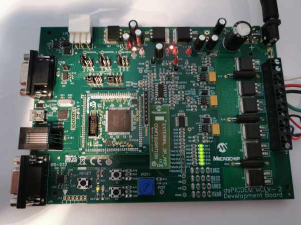
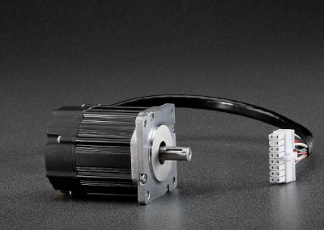
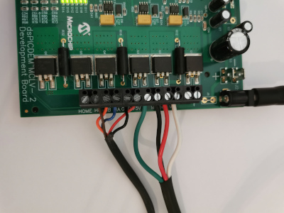
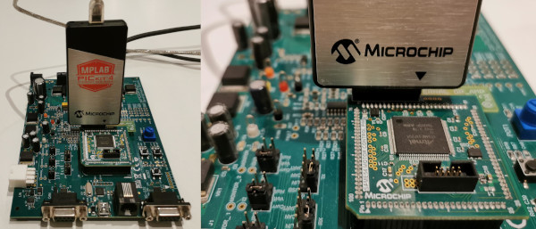
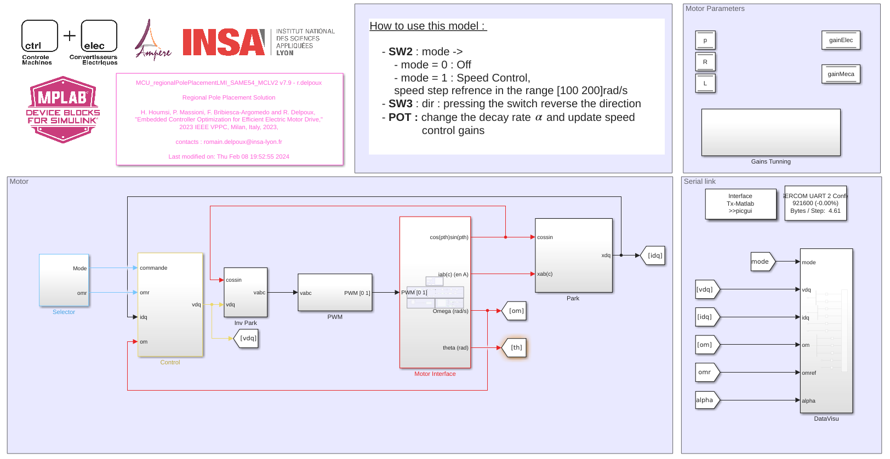
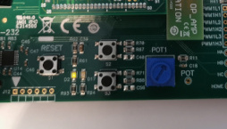
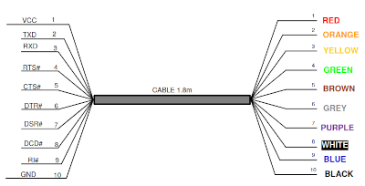
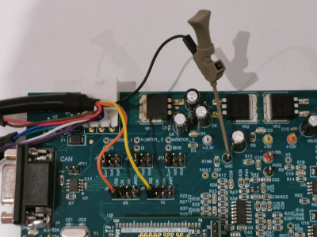
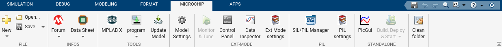
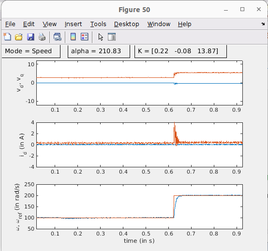

# MATLAB MCLV2 board with SAME54  PIM - Regional pole placement -  Tutorial

## 1. Introduction

This document describes the setup requirement for running the proposed regional pole placement vector control solution.

## 2. SUGGESTED DEMONSTRATION REQUIREMENTS

### 2.1 MATLAB Model Required for the Demonstration

- MATLAB model can be cloned or downloaded as zip file from the Github repository ([link](https://github.com/rdelpoux/ctrl-elec/tree/main/MCU/vectorControl)).

### 2.2 Software Tools Used for Testing the MATLAB/Simulink Model

- [MPLAB X IDE and IPE (v6.00)](https://www.microchip.com/en-us/tools-resources/develop/mplab-x-ide) and [XC32 compiler (v2.00)](https://www.microchip.com/en-us/tools-resources/develop/mplab-xc-compilers)

 

- [Matlab R2023a](https://fr.mathworks.com/) and [Mplab Device Block for Simulink (v3.50.34b)](https://fr.mathworks.com/matlabcentral/fileexchange/71892-mplab-device-blocks-for-simulink-dspic-pic32-and-sam-mcu)

- Required MATLAB add-on packages
  - Simulink (v10.7)
  - Simulink Coder (v9.8)
  - MATLAB Coder (v5.5)
  - Embedded Coder (v7.9)

> **_NOTE:_**
> The software used for testing the model during release is listed above. It is recommended to use the version listed above or later versions for building the model.

### 2.3 Hardware Requirements

The demonstration uses a [MCLV-V2](https://www.microchip.com/dsPICDEMMCLV-2DevelopmentBoard866) Motor Control Board with [PIM ATSAME54](https://www.microchip.com/DevelopmentTools/ProductDetails/PartNO/MA320207) and external Op-Amp 

The example can be used with [Teknic-2310P motor](https://www.digikey.fr/fr/products/detail/texas-instruments/LVSERVOMTR/5005342)

## 3. Hardware Setup

This section describes hardware setup required for the demonstration.

- Connect the 3-phase wires from the motor to M1, M2 and M3 of the J7 connector, provided on the MCLV2 Board. 

  | M1    | M2   | M3    |
  | ----- | ---- | ----- |
  | Black | Red  | White |
  
- Connect the encoder wires to +5V, GND, HA, HB and HC  of the J7 connector, provided on the MCLV2 Board.

  | +5V  | GND   | HA   | HB     | HC    |
  | ---- | ----- | ---- | ------ | ----- |
  | Red  | Black | Blue | Orange | Brown |

- Plug a 24V power supply to **connector J2** on the MCLV2 Board. Alternatively, the Inverter Board can also be powered through connector J7.
- Programmers like PicKit or Snap can directly be connected to the [PIM ATSAME54](https://www.microchip.com/DevelopmentTools/ProductDetails/PartNO/MA320207) as shown on the picture below.

  

## 4. BASIC DEMONSTRATION

Follow the below instructions step-by-step, to set up and run the motor control demo:

1. The model do not require any additional external file such as mfile to run.

2. Open the MCU_regionalPolePlacementLMI_SAME54_MCLV2.slx Simulink model

3. This opens the Simulink model as shown below.

   

4. From this Simulink model an MPLAB X project can be  generated, and it can be used to run the PMSM motor using LVMCr Board. 

6. To generate the code from the Simulink model, go to the **"MICROCHIP"** tab, and enable the tabs shown in the figure below.

   

7. To generate the code and run the motor, click on **‘Build Model’ or ‘Clean Build Model’** option under the **“Microchip”** tab. This will generate the MPLAB X project from the Simulink model and program the SAME54 device.

     

8. After completing the process, the **‘Operation Succeeded’** message will be displayed on the **‘Diagnostics Viewer’**.

9. If the device is successfully programmed, **LED- LD2** will be blinking.

   

10. Keep the potentiometer (**POT**) position at the left and wait 1s, for the motor alignement strategy to find the encoder initial position. Then, to start the demo, press the push button **SW2** to start speed mode. 

11. In this mode, the motor is enabled and a repeating sequence stair is applied as speed reference to the motor, in the interval [100 200] rad/s and changes every second

12. Use the potentiometer (**POT**) to increase or reduce the speed control gains. The gains are computed to obtain gains in the defined region  (see page [Embedded controller optimization](https://ctrl-elec.fr/mcu_electric_motor_Linear_Matrix_Inequality.html)) .

## 5. DATA VISUALIZATION USING PICGUI

The proposed algorithm comes with the possibility to vizualize data using PICGUI interface. More details on this section is available on the [Motor Control University - Data Visualization page](https://ctrl-elec.fr/mcu_electric_motor_embeddedCode_datavisu.html). [MPLAB Device Blocks for Simulink](https://www.mathworks.com/matlabcentral/fileexchange/71892) provide a simple but powerful graphical user interface. It allows to send and receive data from the chip using a Serial link.

1. Connection to the PC

   Although the board has ports to connect a serial link (USB, RS232), in this example we are using an special [FTDI cable](https://www.ftdichip.com/Support/Documents/DataSheets/Cables/DS_C232HD_UART_CABLE.pdf). The USB 2.0 Hi-Speed to UART cable incorporates FTDI’s FT232H USB to UART interface IC device which handles all the USB signalling and protocols.  The cable provides a fast, simple way to connect devices with 3.3 volt digital interfaces to USB. 
   [FTDI cable Driver](https://www.ftdichip.com/Drivers/VCP.htm)

   ### 

   - The TX pin (orange pin 2) must be connected RX pin (mikroBUS A) of the LVMC Board.
   - The RX pin (yellow pin 3) must be connected TX pin (mikroBUS A) of the LVMC Board.
   - Do not forget to connect the GND (black pin 10) to the LVMC board.

   The pin connection is represented below:

   ### 

2. On the computer side, once the code has been program on the chip. The **PicGui** interface allows the data visualization. **PicGui** is directly accessible from the microchip banner:

   

3. It opens the following window:

   

   4. Select the correct port, and the correct baudrate 921 600 bauds in this example. Then click on **Connexion**.

   5. To visualize the data, click on button **Start**.

   6. For better data visualization, download the mfile *DataVisu.m* from Github repository ([link](https://github.com/rdelpoux/ctrl-elec/tree/main/MCU/LMIsolver)) and enter the DataVisu in thepicgui central windows. 

      Results should looks like on the figure below:

      

      The window highlight the mode, the Decay rate and the computed gains.

## 6. REFERENCES:

For more information, refer to the following documents or links :

- The FOC algorithm proposed in the exemple is detailled on the [ctrl+elec website](https://www.ctrl-elec.fr)
  - [Motor Control University - Field Oriented Control (FOC)](mcu_electric_motor_field_oriented_control_FOC.html)
  - [Motor Control University - Embedded code implementation](https://ctrl-elec.fr/mcu_electric_motor_embeddedCode_intro.html)
- Videos about the example can be found on the youTube channel [@ctrl_elec](https://www.youtube.com/@ctrl_elec)
  - [MCU - Vector Control - Getting Started](https://youtu.be/fAhIvsgS1aM?si=tAoGpcwJagEB3y5x)
- This Tutorial was inspired by Microchip MPLAB DISCOVER Example :
  - [MATLAB-Simulink model for Sensorless FOC control using Sliding mode observer (SMO)](https://mplab-discover.microchip.com/v2/item/com.microchip.code.examples/com.microchip.matlab.project/com.microchip.subcategories.motor-control-and-drive/com.microchip.matlab.project.matlab-mclv-48v-300w-dspic33ck64mc105-foc-smo/1.0.0?view=about)
