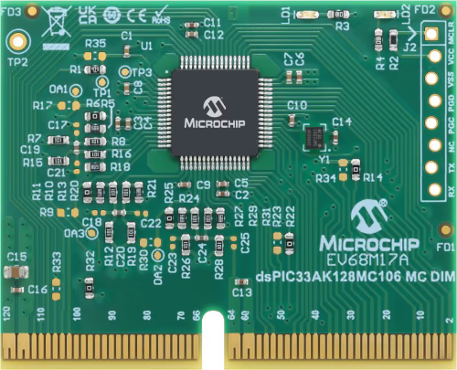
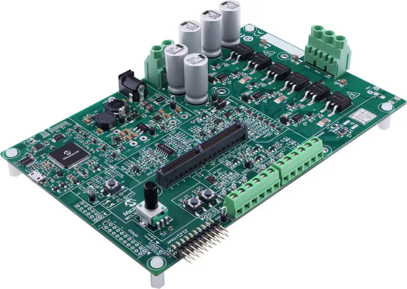
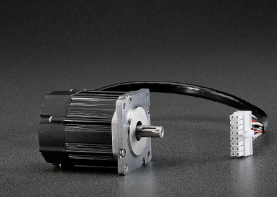

# 

# ctrl+elec Lab

## Authors

- Romain DELPOUX (Romain.Delpoux at insa-lyon.fr), Assistant Professor, INSA de Lyon, Laboratoire Ampère UMR CNRS 5005.
- Lubin KERHUEL (Lubin.Kerhuel at microchip.com), PhD, Microchip Technology Inc.

## Objectives

This Git folder in the [ctrl+elec](www.ctrl-elec.fr) repository contains the tutorials and Matlab/Simulink files used for practical sessions. The goal is to guide users step by step towards the experimental implementation of a vector control law in rapid prototyping on Microchip [MCS MCLV-48V-300W Development Board](https://www.microchip.com/en-us/development-tool/ev18h47a) using [dsPIC33AK128MC106](https://www.microchip.com/en-us/development-tool/EV68M17A) DSC.

### [**The tutorial for this lab is available on the wiki page**](https://github.com/rdelpoux/ctrl-elec/wiki/ctrlelecLab)

- [dsPIC33AK128MC106](https://www.microchip.com/en-us/development-tool/EV68M17A)

  

- [MCS MCLV-48V-300W Development Board](https://www.microchip.com/en-us/development-tool/ev18h47a)

  

  - The connections and use of the board for the various examples is given here: [MCLV_48V_300W_demoBoard.md](./../supportedBoard/MCLV_48V_300W_demoBoard.md)
  
- [Teknic-2310P motor](https://www.digikey.fr/fr/products/detail/texas-instruments/LVSERVOMTR/5005342)

