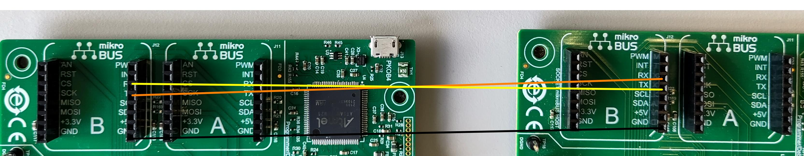
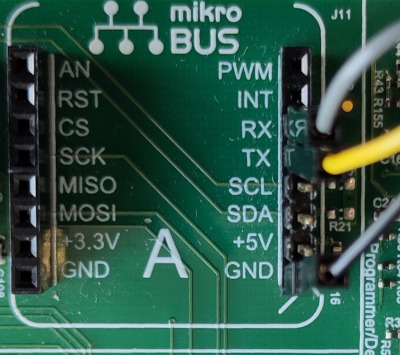
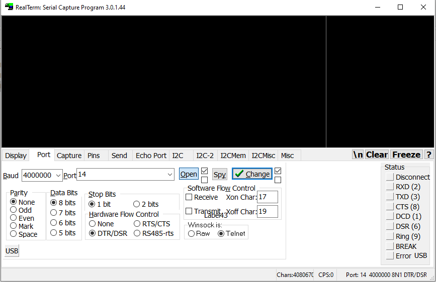
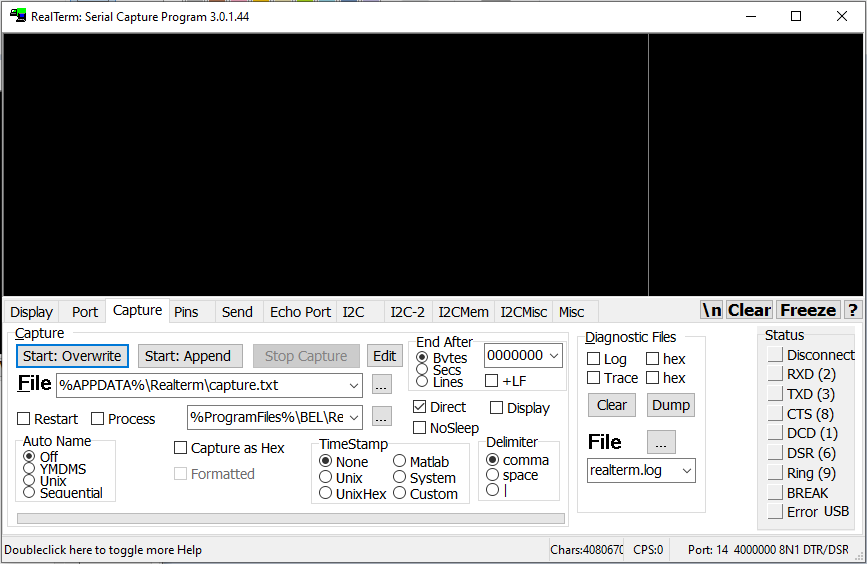
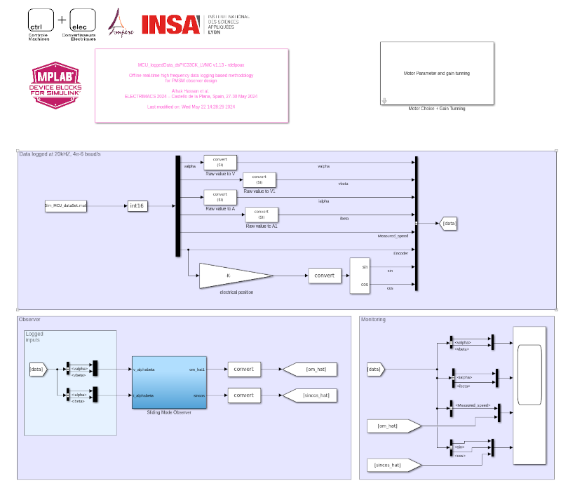
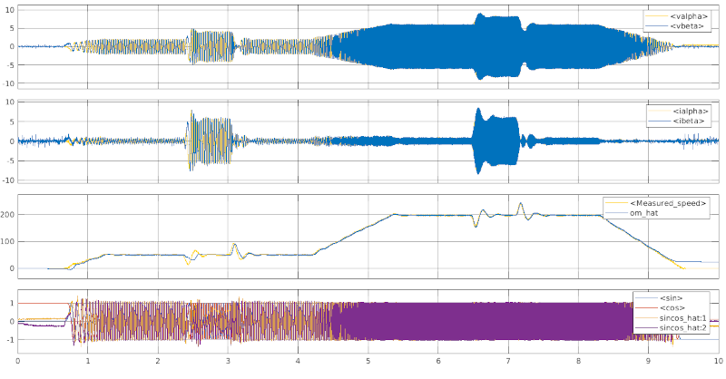

# MATLAB dsPIC33CK LVMC board - Data Logging

## 1. Introduction

The work presents a methodology for a faster development of observers.  On board real-time high frequency measurements are logged and used as  inputs to validate an open-loop observer in an offline simulation. It  allows embedded implementation constraints to be taken into account as  early as possible in the development process. The proposed method  facilitates and speeds up the design procedure compared to on-board  validation, which often involves trial and error gain tuning **(Alhaj2024_Electrimacs)**. For further informations visits the page [MCU PMSM observer design](https://ctrl-elec.fr/mcu_electric_motor_avanced_control_sensorless.html) 

## 2. SUGGESTED DEMONSTRATION REQUIREMENTS

### 2.1 MATLAB Model Required for the Demonstration

- MATLAB model can be cloned or downloaded as zip file from the Github repository ([link](https://github.com/rdelpoux/ctrl-elec/tree/main/MCU/vectorControl)).

### 2.2 Software Tools Used for Testing the MATLAB/Simulink Model

- [MPLAB X IDE and IPE (v6.00)](https://www.microchip.com/en-us/tools-resources/develop/mplab-x-ide) and [XC16 compiler (v2.00)](https://www.microchip.com/en-us/tools-resources/develop/mplab-xc-compilers)

 

- [Matlab R2023a](https://fr.mathworks.com/) and [Mplab Device Block for Simulink (v3.50.34b)](https://fr.mathworks.com/matlabcentral/fileexchange/71892-mplab-device-blocks-for-simulink-dspic-pic32-and-sam-mcu)

- Required MATLAB add-on packages
  - Simulink (v10.7)
  - Simulink Coder (v9.8)
  - MATLAB Coder (v5.5)
  - Embedded Coder (v7.9)
  - Fixed-Point Designer (v7.6)

> **_NOTE:_**
> The software used for testing the model during release is listed above. It is recommended to use the version listed above or later versions for building the model.

### 2.3 Hardware Requirements

The demonstration uses a [dsPIC33CK LVMC](https://www.microchip.com/en-us/development-tool/dm330031) board

The example can be used with different motors, including

- [Teknic-2310P motor](https://www.digikey.fr/fr/products/detail/texas-instruments/LVSERVOMTR/5005342)

- [Hurst Long - AC300022 - with encoder](https://fr.farnell.com/en-FR/microchip/ac300022/bldc-motor-3-phase-w-encoder/dp/1688718)

## 3. Getting Started

To evaluate the efficiency of the different observer available in the literature, on board real-time high frequency measurements are logged using the industrial benchmark from the literature **(Glumineau2015)**:

### 

This trajectory has the advantage of being able to test the observer on start-up, at low and high speeds and under load. 

For this purpose, a test bench with two motors, mechanically connected by their shafts, is used.

One motor plays the sources, while the second play the load, then 2 [dsPIC33CK LVMC](https://www.microchip.com/en-us/development-tool/dm330031) board are required for this tutorial. The following programs can be flashed into the board

- Motor 1: [MCU_PMSM1_Trajectoire_dsPIC33CK_LVM.slx](https://github.com/rdelpoux/ctrl-elec/blob/main/MCU/dataLogging/MCU_PMSM1_Trajectoire_dsPIC33CK_LVM.slx)
- Motor 2: [MCU_PMSM2_Load_dsPIC33CK_LVMC.slx](https://github.com/rdelpoux/ctrl-elec/blob/main/MCU/dataLogging/MCU_PMSM2_Load_dsPIC33CK_LVMC.slx)

Both code works as described in the tutorial [MATLAB dsPIC33CK LVMC board - FOC Tutorial](https://github.com/rdelpoux/ctrl-elec/blob/main/MCU/vectorControl/README.md).

In order to synchronize both motor and play the load with the second board, a serial link between both demo board must be plugged. For this purpose, **mikroBUS B** on both board are used.  As shown on the figure below, **RX** (resp. **TX**) board 1 is connected to **TX** (resp. **RX**) board 2, and the **GND** must be linked.

**Be careful, if large load are applied, it must be require to connect a chopper on DC bus to avoide over-voltages due to braking. **

Once both code are are flashed into the board :

1. On board 2, the potentiometer is used to define the load reference in the range [0 imax] (in A).
2. Activate board 2: press **S1** followed by **S2** (both once) to start the code and select the load control mode. Board 2 is waiting for the signal of board 1 to play the load
3. On board 1, the potentiometer is used to define the speed reference in the range [0 ommax] (in rad).
4. Activate board 1: press **S1** followed by **S2** (both once) to start the code and select the speed control mode. Board 2 is waiting for the signal of board 1 to play the load
5. If the board are correctly connected together, the LED **LD11** lights up when the 

## 4. Real-time high frequency data logging

The objective of this tutorial is to provide high frequency data logging at 20kHz. Thanks to the realization of real-time high frequency data logging, the observer synthesis can be first tuned offline on real data, before being tested on-board. 

### 4.1. Configuration

For this purpose, the baudrate of the serial link between board 1 and the computer was selected to 4 000 000 baud/s. To avoid data loss during the transfer, the **TX** pin was replaced on **mikroBUS A** by the **DTR** (Data Terminal Ready) pin, gray cable on the [FTDI cable](https://www.ftdichip.com/Support/Documents/DataSheets/Cables/DS_C232HD_UART_CABLE.pdf) (see [Embedded code implementation - Data Visualization](https://ctrl-elec.fr/mcu_electric_motor_embeddedCode_datavisu.html) as represented below. The DTR signal confirms to the board that the computer is available to accept data.

 

Instead of using **picgui** as usual, the [RealTerm](https://realterm.sourceforge.io/) is used. It allows to log data faster than picgui.

On the port window : 

1. Change baudrate to 4000000
2. Select the port as the port corresponding to the FTDI cable. 
3. Select DTR/DSR in the Hadware Flow Control 

as represented on figure below 

### 4.2. Data Transfer

Board 1 sends data when the speed control mode is activated only. To store the data : 

1. On the RealTerm window Capture, click on Start: Overwrite button. When board 1 sends data it will be recorded 

   

2. Press **S1** followed by **S2** (both once) to start the code and select the speed control mode on board 1. 

3. When the trajectory is terminated, click on Stop Capture in the RealTerm window. 

4. The capture.txt is saved on the computer. 

### 4.3. Data formatting

TBD

### 4.4. Data Simulation

When the data have the correct format, it is possible to play the logged data from Simulink. For this purpose, a Simulink file is available on-line:  [MCU_loggedData_dsPIC33CK_LVMC.slx](https://github.com/rdelpoux/ctrl-elec/blob/main/MCU/dataLogging/MCU_loggedData_dsPIC33CK_LVMC.slx). The Simulink file come with a set of data: [Sim_MCU_dataSet.mat](https://github.com/rdelpoux/ctrl-elec/blob/main/MCU/dataLogging/Sim_MCU_dataSet.mat)  to be played, in case your own data are not available. It allows the test of different observers without the need of hardware setup. 

As a result the scope provides the chronograph represented below: 

The example provides a sliding mode observer from the litterature **(Utkin2003)**.

## References

**(Alhaj2024_Electrimacs)** S. Alhaj Hassan, R. Delpoux, L. Kerhuel, V. Léchappé & Xavier Brun (2024) “Offline real-time high  frequency data logging based methodology for PMSM observer design”,  Proceedings of ELECTRIMACS 2024 – Castello de la Plana, Spain, 27-30 May 2024.

**(Utkin2003)** Utkin, V., Guldner, J., & Shi, J. (2009). Sliding Mode Control in Electro-Mechanical Systems (2nd ed.). CRC Press. https://doi.org/10.1201/9781420065619