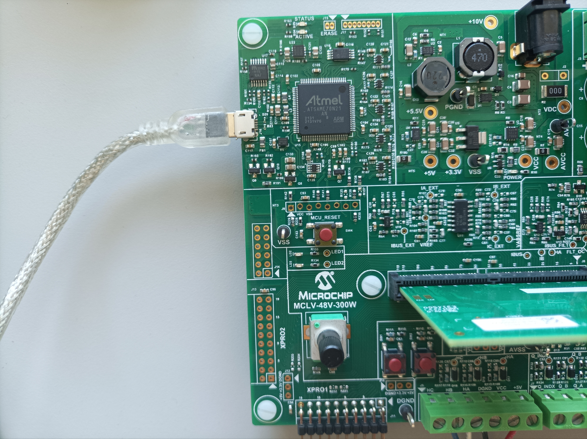
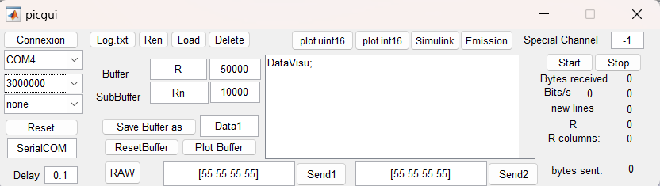

# [MCS MCLV-48V-300W Development Board](https://www.microchip.com/en-us/development-tool/ev18h47a)

## 1. Introduction

This document describes the hardware requirement to run examples using the [MCS MCLV-48V-300W Development Board](https://www.microchip.com/en-us/development-tool/ev18h47a)

## 2. Hardware Setup

This section describes hardware setup required for the demonstration.

- Connect the 3-phase wires from the motor to PHA, PHB, and PHC of the J4 connector, provided on the board. For both motors:

  

  | PHA   | PHB  | PHC   |
  | ----- | ---- | ----- |
  | White | Red  | Black |

- Connect the encoder wires to +5V, DGND, Q_A, Q_Band Q_INDX of the J7 connector, provided on the from board. For both motors:

  - For Teknic-2310P motor:

    probleme photo

  
  
  | +5V  | VCC  | DGND  | Q_A  | Q_B    | Q_INDX |
  | ---- | ---- | ----- | ---- | ------ | ------ |
  | Red  | NC   | Black | Blue | Orange | Brown  |

  - For Hurst Long - AC300022
  
  

| +5V  | VCC  | DGND  | Q_A   | Q_B  | Q_INDX |
| ---- | ---- | ----- | ----- | ---- | ------ |
| Red  | NC   | Black | White | Blue | NC     |

- Plug a 24V power supply to **connector J3** on the LVMC Board. Alternatively, the Inverter Board can also be powered through connector J1.
- The board has an onboard programmer **PICkit™ On Board (PKoBv4)** , which can be used for programming or debugging the microcontroller or dsPIC DSC on the Board. To use the onboard programmer, connect a  micro-USB cable between the Host PC and **connector J16** on the LVMC Board.

  

## 4. BASIC DEMONSTRATION

Follow the below instructions step-by-step, to set up and run the motor control demo:

1. The model do not require any additional external file such as mfile to run.

2. Open the MCU_vectorControl_MCLV_48V_300W_dsPIC33CK.slx Simulink model

   

3. This opens the FOC Simulink model as shown below.

   

4. Define the motor used:

   - The model provides a mask which allows to define the motor choice and compute the control gains with respect to the motor choice.

      

   - Double click on the bloc to open the dialogue window:

      - For motor choice, predefined motor have been registered, to use another motor, select Custom and enter the parameter directly:

      

      - For the selected motor, the gain tunning is updated. The damping factor and the time response can be adjusted. (see [FOC control page](https://ctrl-elec.fr/mcu_electric_motor_field_oriented_control_controller.html) for tunning details).

      

5. Click on the double wire icon to highlight timing legend 

   

6. From this Simulink model an MPLAB X project can be  generated, and it can be used to run the PMSM motor using LVMCr Board. 

   To generate the code from the Simulink model, go to the **"MICROCHIP"** tab, and enable the tabs shown in the figure below.

   

7. To generate the code and run the motor, click on **‘Build Model’ or ‘Clean Build Model’** option under the **“Microchip”** tab. This will generate the MPLAB X project from the Simulink model and program the dsPIC33CK256MP508 device.

     

8. After completing the process, the **‘Operation Succeeded’** message will be displayed on the **‘Diagnostics Viewer’**.

9. If the device is successfully programmed, **LED- LD2** will be blinking.

   

10. Keep the potentiometer (**POT**) position at the left. Then, to start the demo, press the reset push button **SW4**. Wait 1s, an alignement strategy find the encoder initial position for the case where no index is present. 

11. In this mode, the motor is enabled to run clockwise in voltage mode. The reference voltage is set by the potentiometer **POT**. To run in anticlockwise direction press **SW2**

12. To activate the velocity control, press the button **SW1**. In this mode, potentiometer **POT** sets the reference speed. 

## 5. DATA VISUALIZATION USING PICGUI

The proposed algorithm comes with the possibility to vizualize data using PICGUI interface. More details on this section is available on the [Motor Control University - Data Visualization page](https://ctrl-elec.fr/mcu_electric_motor_embeddedCode_datavisu.html). [MPLAB Device Blocks for Simulink](https://www.mathworks.com/matlabcentral/fileexchange/71892) provide a simple but powerful graphical user interface. It allows to send and receive data from the chip using a Serial link.

1. Connection to the PC

   Although the board has ports to connect a serial link (USB, RS232), in this example we are using an special [FTDI cable](https://www.ftdichip.com/Support/Documents/DataSheets/Cables/DS_C232HD_UART_CABLE.pdf). The USB 2.0 Hi-Speed to UART cable incorporates FTDI’s FT232H USB to UART interface IC device which handles all the USB signalling and protocols.  The cable provides a fast, simple way to connect devices with 3.3 volt digital interfaces to USB. 
   [FTDI cable Driver](https://www.ftdichip.com/Drivers/VCP.htm)

   ### 

   - The TX pin (orange pin 2) must be connected RX pin (J11 pin 13) of the LVMC Board.
   - The RX pin (yellow pin 3) must be connected TX pin (J11 pin14) of the LVMC Board.
   - Do not forget to connect the GND (black pin 10) to the LVMC board.

   The pin connection is represented below:

   

2. On the computer side, once the code has been program on the chip. The **PicGui** interface allows the data visualization. **PicGui** is directly accessible from the microchip banner:

   

3. It opens the following window:

   

   4. Select the correct port, and the correct baudrate 3 000 000 bauds in this example. Then click on **Connexion**.

   5. To visualize the data, click on button **Start**.

   6. For better data visualization, download the mfile *DataVisu.m* from Github repository ([link](https://github.com/rdelpoux/ctrl-elec/tree/main/MCU/vectorControl)) and enter the DataVisu in thepicgui central windows. 

      Results should looks like on the figure below:

      

      The window highlight the mode (Voltage/Speed), the measured DC voltage, The Max Voltage according to the chosen SVM and the CPU load.

## 6. REFERENCES:

For more information, refer to the following documents or links :

- The FOC algorithm proposed in the exemple is detailled on the [ctrl+elec website](https://www.ctrl-elec.fr)
  - [Motor Control University - Field Oriented Control (FOC)](mcu_electric_motor_field_oriented_control_FOC.html)
  - [Motor Control University - Embedded code implementation](https://ctrl-elec.fr/mcu_electric_motor_embeddedCode_intro.html)
- Videos about the example can be found on the youTube channel [@ctrl_elec](https://www.youtube.com/@ctrl_elec)
  - [MCU - Vector Control - Getting Started](https://youtu.be/fAhIvsgS1aM?si=tAoGpcwJagEB3y5x)
- This Tutorial was inspired by Microchip MPLAB DISCOVER Example :
  - [MATLAB-Simulink model for Sensorless FOC control using Sliding mode observer (SMO)](https://mplab-discover.microchip.com/v2/item/com.microchip.code.examples/com.microchip.matlab.project/com.microchip.subcategories.motor-control-and-drive/com.microchip.matlab.project.matlab-mclv-48v-300w-dspic33ck64mc105-foc-smo/1.0.0?view=about)
