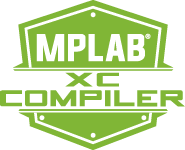
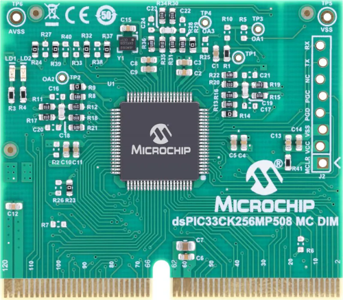
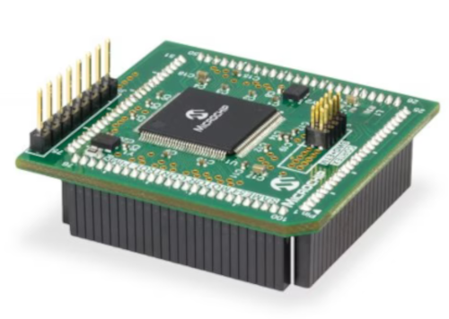
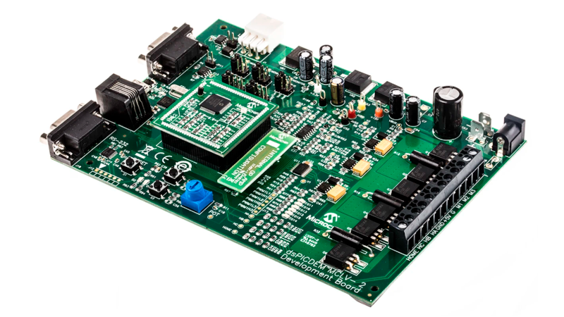

# Supported Boards

[TOC]

## 1. Introduction 

This document describes software and hardware required to use the proposed examples in the repository. 

In this repository, all Simulink examples files are named in the same way as :

```matlab
MCU_example_DSC_demoBoard.slx
```

where

- **example** describes the control algorithm developed in the example :
  - [vectorControl](./vectorControl/README.md)
  - [fieldWeakening](./fieldWeakening/README.md)
  - [regionalPolePlacementLMI](./LMIsolver/README.md)
  - ...
- **DSC** describes the DSC used for the demonstration. The examples in this repository uses alternatively
  - [dsPIC33AK128MC106](https://www.microchip.com/en-us/development-tool/EV68M17A)
  - [dsPIC33CK256MP508](https://www.microchip.com/en-us/development-tool/ev62p66a)
  - [ATSAME54P20A](https://www.microchip.com/en-us/development-tool/MA320207)
- **demoBoard** describes the demonstration board used for the exemple. Three boards are used in the repository : 
  - [MCS MCLV-48V-300W Development Board](https://www.microchip.com/en-us/development-tool/ev18h47a)
  - [DSPIC33CK LOW VOLTAGE MOTOR CONTROL (LVMC) DEVELOPMENT BOARD](https://www.microchip.com/en-us/development-tool/DM330031)
  - [DSPICDEM™ MCLV-2 DEVELOPMENT BOARD ](https://www.microchip.com/en-us/development-tool/dm330021-2)

## 2. SUGGESTED DEMONSTRATION REQUIREMENTS

### 2.1 MATLAB Model Required for the Demonstration

- MATLAB model can be cloned or downloaded as zip file from the Github repository ([link](https://github.com/rdelpoux/ctrl-elec/tree/main/MCU/vectorControl)).

### 2.2 Software Tools Used for Testing the MATLAB/Simulink Model

- [MPLAB X IDE and IPE (v6.00)](https://www.microchip.com/en-us/tools-resources/develop/mplab-x-ide) and [XC16 compiler (v2.00)](https://www.microchip.com/en-us/tools-resources/develop/mplab-xc-compilers)

[](https://www.microchip.com/en-us/tools-resources/develop/mplab-x-ide) [](https://www.microchip.com/en-us/tools-resources/develop/mplab-xc-compilers)


- [Matlab R2023a](https://fr.mathworks.com/) and [Mplab Device Block for Simulink (v3.50.34b)](https://fr.mathworks.com/matlabcentral/fileexchange/71892-mplab-device-blocks-for-simulink-dspic-pic32-and-sam-mcu)

[](https://fr.mathworks.com/)[](https://fr.mathworks.com/matlabcentral/fileexchange/71892-mplab-device-blocks-for-simulink-dspic-pic32-and-sam-mcu)

- Required MATLAB add-on packages
  - Simulink (v10.7)
  - Simulink Coder (v9.8)
  - MATLAB Coder (v5.5)
  - Embedded Coder (v7.9)
  - Fixed-Point Designer (v7.6)

> **_NOTE:_**
> The software used for testing the model during release is listed above. It is recommended to use the version listed above or later versions for building the model.

### 2.3 Motor used 

The proposed examples can be used with different motors, including

- [Teknic-2310P motor](https://www.digikey.fr/fr/products/detail/texas-instruments/LVSERVOMTR/5005342)


- [Hurst Long - AC300022 - with encoder](https://fr.farnell.com/en-FR/microchip/ac300022/bldc-motor-3-phase-w-encoder/dp/1688718)


Note that the Hurst Long do not provide encoder index and require an algorithm for initialization of the encoder. 

## 2.4 DSC

- The examples in this repository uses alternatively

  - [dsPIC33AK128MC106](https://www.microchip.com/en-us/development-tool/EV68M17A)

    

  - [dsPIC33CK256MP508](https://www.microchip.com/en-us/development-tool/ev62p66a)

    

  - [ATSAME54P20A](https://www.microchip.com/en-us/development-tool/MA320207)
  
    

## 2.5 Demonstration board

- [MCS MCLV-48V-300W Development Board](https://www.microchip.com/en-us/development-tool/ev18h47a)

  

  - The connections and use of the board for the various examples is given here: [MCLV_48V_300W_demoBoard.md](./MCLV_48V_300W_demoBoard.md)

- [DSPIC33CK LOW VOLTAGE MOTOR CONTROL (LVMC) DEVELOPMENT BOARD](https://www.microchip.com/en-us/development-tool/DM330031)

  

  - The connections and use of the board for the various examples is given here: [LVMC_demoBoard.md](./LVMC_demoBoard.md)

- [DSPICDEM™ MCLV-2 DEVELOPMENT BOARD ](https://www.microchip.com/en-us/development-tool/dm330021-2)

  

  - The connections and use of the board for the various examples is given here: [MCLV2_demoBoard.md](./MCLV2_demoBoard.md)

