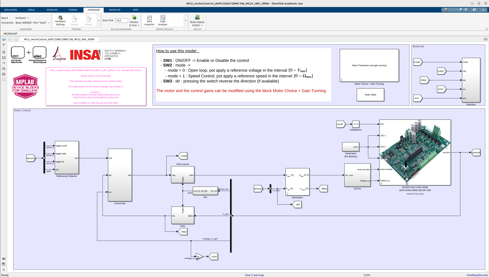
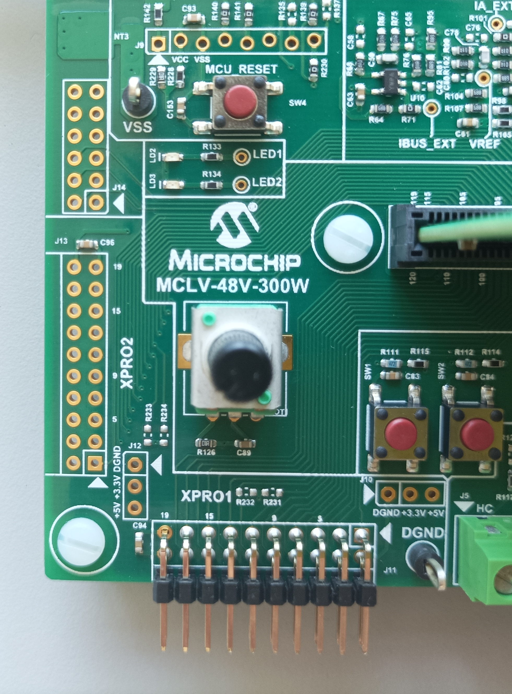

# Vector control tutorial

[YouTube demo](https://youtu.be/fAhIvsgS1aM?si=hjhc9MEHJ1EK3xQb)

## 1. Introduction

This document describes the setup requirement for running the proposed Vector Control, including voltage and current saturations and space vector modulation. The example is design alternatively using floating point of fixed point data types depending on the DSC used, taking care to limit calculation time. The example can be used with different motors.

## 2. SUGGESTED DEMONSTRATION REQUIREMENTS

The suggested demonstration requirements are available here : [Supported Boards](./../supportedBoard/SupportedBoards.md).

The proposed example is proposed for different boards and DSCs:

- [MCS MCLV-48V-300W Development Board](./../supportedBoard/MCLV_48V_300W_demoBoard.md) (Recommended)
  - [dsPIC33AK128MC106](https://www.microchip.com/en-us/development-tool/EV68M17A)
  - [dsPIC33CK256MP508](https://www.microchip.com/en-us/development-tool/ev62p66a)
- [DSPIC33CK LOW VOLTAGE MOTOR CONTROL (LVMC) DEVELOPMENT BOARD](./../supportedBoard/LVMC_demoBoard.md)
- [DSPICDEM™ MCLV-2 DEVELOPMENT BOARD ](./../supportedBoard/MCLV2_demoBoard.md)
  - [ATSAME54P20A](https://www.microchip.com/en-us/development-tool/MA320207)

And Both motors: 

- [Teknic-2310P motor](https://www.digikey.fr/fr/products/detail/texas-instruments/LVSERVOMTR/5005342) (Recommended)
- [Hurst Long - AC300022 - with encoder](https://fr.farnell.com/en-FR/microchip/ac300022/bldc-motor-3-phase-w-encoder/dp/1688718)

### MATLAB Model Required for the Demonstration

- MATLAB model can be cloned or downloaded as zip file from the Github repository ([link](https://github.com/rdelpoux/ctrl-elec/tree/main/MCU/vectorControl)).

## 3. BASIC DEMONSTRATION

Follow the below instructions step-by-step, to set up and run the motor control demo:

1. The model do not require any additional external file such as mfile to run.

2. Open the Simulink model corresponding to the board and DSC available, ex: MCU_vectorControl_dsPIC33A_LVMC.slx Simulink model

   

3. This opens the FOC Simulink model as shown below.

   

4. Define the motor used:

   - The model provides a mask which allows to define the motor choice and compute the control gains with respect to the motor choice.

      

   - Double click on the bloc to open the dialogue window:

      - For motor choice, predefined motor have been registered, to use another motor, select Custom and enter the parameter directly:

      

      - For the selected motor, the gain tunning is updated. The damping factor and the time response can be adjusted. (see [FOC control page](https://ctrl-elec.fr/mcu_electric_motor_field_oriented_control_controller.html) for tunning details).

      

5. Click on the double wire icon to highlight timing legend 

   

6. From this Simulink model an MPLAB X project can be  generated, and it can be used to run the PMSM motor on board. 

   To generate the code from the Simulink model, go to the **"MICROCHIP"** tab, and enable the tabs shown in the figure below.

   

7. To generate the code and run the motor, click on **‘Build Model’ or ‘Clean Build Model’** option under the **“Microchip”** tab. This will generate the MPLAB X project from the Simulink model and program the dsPIC33CK256MP508 device.

     

8. After completing the process, the **‘Operation Succeeded’** message will be displayed on the **‘Diagnostics Viewer’**.

9. If the device is successfully programmed, **LD2** will be blinking.

   

10. How to use this model : 

     1. SW1 : ON/OFF -> Enable or Disable the control

     2. SW2 : mode ->  

          1. mode = 0 : Open loop, (**POT1**) apply a reference voltage in the interval  $[0 - V_{\rm max}]$

          2. mode = 1 : Speed Control, (**POT1**) apply a reference speed in the intervel  $[0 - \Omega_{\rm max}]$

     3. SW3 : dir : pressing the switch reverse the direction (if available)

## 5. DATA VISUALIZATION USING PICGUI

The proposed algorithm comes with the possibility to visualize data using PICGUI interface. More details on this section is available on the [Motor Control University - Data Visualization page](https://ctrl-elec.fr/mcu_electric_motor_embeddedCode_datavisu.html). [MPLAB Device Blocks for Simulink](https://www.mathworks.com/matlabcentral/fileexchange/71892) provide a simple but powerful graphical user interface. It allows to send and receive data from the chip using a Serial link.

1. The connection to the PC depends on the used board. Refers to [Supported Boards](./MCU/supportedBoard/SupportedBoards.md). For the [MCS MCLV-48V-300W Development Board](./../supportedBoard/MCLV_48V_300W_demoBoard.md), the Serial Link is directly provided on board by the USB cable used for programming. 

   

2. On the computer side, once the code has been program on the chip. The **PicGui** interface allows the data visualization. **PicGui** is directly accessible from the microchip banner:

   

3. It opens the following window:

   

4. Select the correct port, and the correct baudrate 460800 bauds for the example on  [MCS MCLV-48V-300W Development Board](./../supportedBoard/MCLV_48V_300W_demoBoard.md). Then click on **Connexion**.

5. To visualize the data, click on button **Start**.

6. For better data visualization, download the mfile *DataVisu.m* from Github repository ([link](https://github.com/rdelpoux/ctrl-elec/tree/main/MCU/vectorControl)) and enter the DataVisu in the picgui central windows. 

7. Results should looks like on the figure below:

   

8. The window highlight the mode (Voltage/Speed), the measured DC voltage, The Max Voltage according to the chosen SVM and the CPU load.

## 6. REFERENCES:

For more information, refer to the following documents or links :

- The FOC algorithm proposed in the exemple is detailled on the [ctrl+elec website](https://www.ctrl-elec.fr)
  - [Motor Control University - Field Oriented Control (FOC)](mcu_electric_motor_field_oriented_control_FOC.html)
  - [Motor Control University - Embedded code implementation](https://ctrl-elec.fr/mcu_electric_motor_embeddedCode_intro.html)
- Videos about the example can be found on the youTube channel [@ctrl_elec](https://www.youtube.com/@ctrl_elec)
  - [MCU - Vector Control - Getting Started](https://youtu.be/fAhIvsgS1aM?si=tAoGpcwJagEB3y5x)
- This Tutorial was inspired by Microchip MPLAB DISCOVER Example :
  - [MATLAB-Simulink model for Sensorless FOC control using Sliding mode observer (SMO)](https://mplab-discover.microchip.com/v2/item/com.microchip.code.examples/com.microchip.matlab.project/com.microchip.subcategories.motor-control-and-drive/com.microchip.matlab.project.matlab-mclv-48v-300w-dspic33ck64mc105-foc-smo/1.0.0?view=about)
