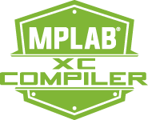
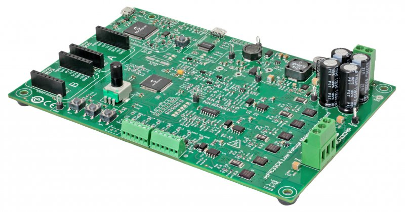

# Vector Control Tutorial

## Software Requirements

- Microchip IDE + Compiler

 

- Matlab + Mplab Device Block for Simulink

## Hardware Requirements

The demonstration uses a [dsPIC33CK LVMC](https://www.microchip.com/en-us/development-tool/dm330031) board

The example can be used with different motors, including

- [Teknic-2310P motor](https://www.digikey.fr/fr/products/detail/texas-instruments/LVSERVOMTR/5005342)

- [Hurst Long - AC300022 - with encoder](https://fr.farnell.com/en-FR/microchip/ac300022/bldc-motor-3-phase-w-encoder/dp/1688718)

## Motor Connections

- Phase Voltage (Both motors)

  

  | PHA   | PHB  | PHC   |
  | ----- | ---- | ----- |
  | White | Red  | Black |

- Encoder

  - Teknic-2310P

  

  | +5V  | +3.3V | DGND  | QEA  | QEB    | INDX  |
  | ---- | ----- | ----- | ---- | ------ | ----- |
  | Red  | NC    | Black | Blue | Orange | Brown |

  - Hurst Long - AC300022

  

| +5V  | +3.3V | DGND  | QEA   | QEB  | INDX |
| ---- | ----- | ----- | ----- | ---- | ---- |
| Red  | NC    | Black | White | Blue | NC   |

